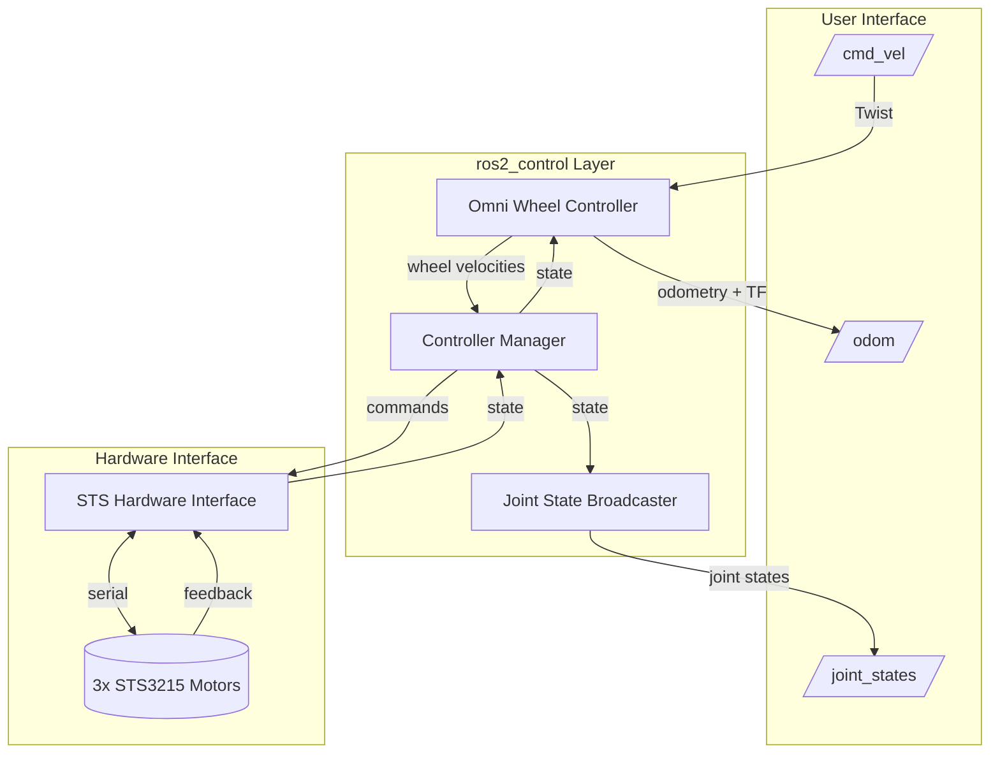

# LeKiwi Base Control Architecture

High-level overview of the robot control system design and component interactions.

## System Overview

The LeKiwi robot uses a standard ROS 2 control architecture with three main components:

- **Hardware Interface**: Communicates with motors via serial
- **Controller Manager**: Coordinates control loop execution
- **Controllers**: Handle robot-level behaviors (motion, state publishing)

## Architecture Diagram



## Component Responsibilities

### Hardware Interface Layer

**STS Hardware Interface** (`sts_hardware_interface` package):

- Serial communication with motors at 1000000 baud
- Unit conversion (motor units ↔ SI units)
- Multi-turn position tracking
- Broadcast emergency stop handling (system-level)
- State interfaces: position, velocity, load, voltage, temperature, current
- Command interfaces (per-joint): velocity, acceleration
- Command interface (system-level): emergency_stop

### Control Layer

**Controller Manager**:

- Loads controller plugins
- Executes control loop at 50 Hz
- Routes commands and state between hardware and controllers

**Omni Wheel Drive Controller**:

- Subscribes to `/cmd_vel` (robot velocity commands)
- Publishes `/odom` (robot pose and velocity)
- Performs inverse kinematics: (vx, vy, ω) → (ω₁, ω₂, ω₃)
- Performs forward kinematics: wheel states → robot pose
- Position-based odometry for accuracy
- Timeout-based emergency stop (0.5s)

**Joint State Broadcaster**:

- Publishes `/joint_states` from hardware feedback
- Reports wheel positions and velocities

## Robot Kinematics

### Wheel Configuration

- **3-wheel omnidirectional** layout
- Wheel positions: 60°, 180°, 300° from +X axis
- Robot radius: 0.1322 m (center to wheel)
- Wheel radius: 0.051 m

### Motor Configuration

- **Motor IDs**: Left (7), Back (8), Right (9)
- **Operating Mode**: Velocity mode (mode=1)
- **Serial Port**: /dev/ttySERVO at 1000000 baud
- **Hardware Limits**:
  - Max velocity: 3400 steps/s (hardware maximum)
  - Max acceleration: 254 (raw value, 25,400 steps/s² physical)

### Velocity Limits

Based on omnidirectional kinematics with 80% of hardware maximum (2720 steps/s = 4.17 rad/s):

- **Max linear X**: 0.246 m/s
- **Max linear Y**: 0.213 m/s (limiting direction)
- **Max angular Z**: 1.61 rad/s (92.23 deg/s)

### Acceleration Limits

Based on 100% hardware maximum (25,400 steps/s² = 38.97 rad/s²):

- **Max linear X**: 2.29 m/s²
- **Max linear Y**: 1.99 m/s² (limiting direction)
- **Max angular Z**: 15.03 rad/s² (861 deg/s²)

### Kinematic Calculations

For 3-wheel omni drive:
- **Inverse kinematics**: ω_i = (-sin(θ_i)·v_x + cos(θ_i)·v_y + R·ω_z) / r
- **Acceleration derivative**: α_i = (-sin(θ_i)·a_x + cos(θ_i)·a_y + R·α_z) / r

All limits are calculated parametrically from hardware constants to ensure consistency between URDF and controller configuration.

## Configuration Files

### URDF (base.urdf.xacro)

Defines robot physical structure:

- 3 wheel joints at specific angles (60°, 180°, 300°)
- Motor IDs and operating modes
- Hardware interface parameters
- Multi-turn tracking enabled
- Includes properties from `base_properties.xacro`

### Controller Config (base_controllers.yaml)

Defines controller behavior:

- Update rate (50 Hz)
- Wheel geometry parameters
- Velocity/acceleration limits (matches URDF calculations)
- Odometry settings

### Properties (base_properties.xacro)

Shared robot properties (single source of truth):

- Wheel dimensions (radius, thickness, base offset)
- Motor specifications (IDs, operating mode, serial config)
- Hardware limits (max velocity/acceleration in steps and rad/s)
- Parametric velocity/acceleration calculations for each axis
- All values automatically propagated to URDF

## Data Flow

1. **Command Path**: `/cmd_vel` → Omni Wheel Controller → Hardware Interface → Motors
2. **Feedback Path**: Motors → Hardware Interface → Controllers → `/odom` + `/joint_states`
3. **Control Loop**: 50 Hz update cycle managed by Controller Manager

## Design Decisions

### Why Standard Controllers?

- **Proven**: Battle-tested in production systems
- **Maintained**: Active community support
- **Correct**: Proper kinematics implementation
- **Minimal Code**: Configuration-only approach

### Why Position-Based Odometry?

- **Accuracy**: No velocity integration drift
- **Continuous**: Multi-turn tracking for unlimited motion
- **Reliable**: Direct encoder feedback

### Why This Wheel Layout?

- **Omnidirectional**: Full 2D motion capability
- **Symmetric**: Balanced force distribution
- **Standard**: Common 3-wheel configuration

### Why Parametric Configuration?

- **Single Source of Truth**: All properties defined once in `base_properties.xacro`
- **Consistency**: Automatic propagation prevents mismatches
- **Maintainability**: Change once, update everywhere
- **Correctness**: Formulas ensure kinematic calculations match hardware

## Integration Points

### Navigation Stack

The system provides standard interfaces for nav2:

- `/cmd_vel` for velocity commands
- `/odom` for localization
- TF tree (`odom` → `base_link`)

### Sensors

Additional sensors can be added via:

- URDF links and joints
- Sensor-specific broadcasters
- TF transforms to `base_link`

## Safety Features

- **Emergency Stop**: Automatic on cmd_vel timeout (0.5s)
- **Velocity Limiting**: Enforced in controller (80% hardware max)
- **Acceleration Limiting**: Enforced in controller (100% hardware max)
- **Hardware Protection**: Torque limits in motor firmware

## Extending the System

### Adding New Controllers

1. Create controller configuration in YAML
2. Add to launch file (`base_control.launch.py`)
3. Controller Manager handles the rest

### Changing Robot Geometry

1. Update `base_properties.xacro`
2. Values automatically propagate to `base.urdf.xacro`
3. Manually update corresponding values in `base_controllers.yaml`
4. Rebuild and test

### Changing Motor Limits

1. Update `max_velocity_steps` or `max_acceleration_steps` in `base_properties.xacro`
2. Derived values in URDF (rad/s) automatically recalculate
3. Manually update corresponding values in `base_controllers.yaml` (m/s, rad/s)
4. Rebuild and test

### Adding Sensors

1. Add sensor links to URDF
2. Configure sensor broadcaster
3. Publish sensor data topics

## Performance Characteristics

- **Control Frequency**: 50 Hz
- **Communication Latency**: ~10 ms (serial)
- **Odometry Update Rate**: 50 Hz
- **Position Accuracy**: ±0.001 rad (motor encoder)
- **Velocity Accuracy**: ±0.01 rad/s

## File Structure

```
lekiwi_base_control/
├── urdf/
│   ├── base_properties.xacro    # Single source of truth for all properties
│   └── base.urdf.xacro           # Robot structure (includes properties)
├── config/
│   └── base_controllers.yaml     # Controller configuration
├── launch/
│   └── base_control.launch.py   # Main launch file
└── docs/
    ├── architecture.md           # This file
    └── getting_started.md        # Setup and usage guide
```

## Further Reading

- [ros2_control documentation](https://control.ros.org/)
- [omni_wheel_drive_controller](https://control.ros.org/master/doc/ros2_controllers/omni_wheel_drive_controller/doc/userdoc.html)
- [ROS 2 Hardware Interface Design](https://design.ros2.org/articles/ros2_control.html)
